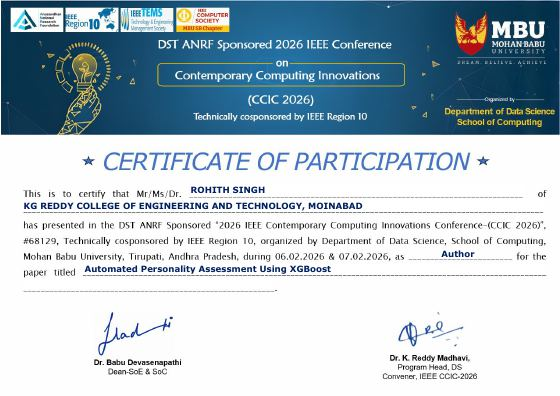
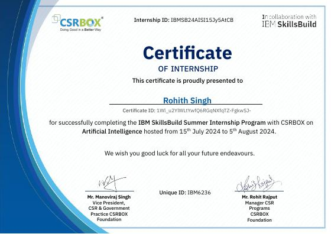
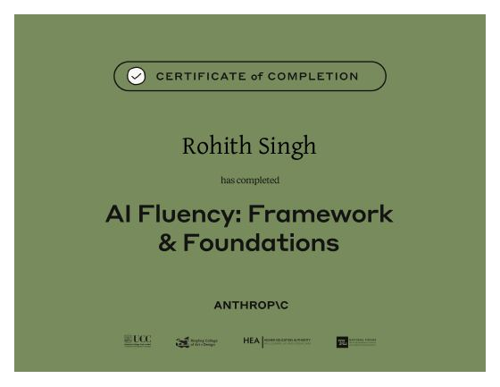
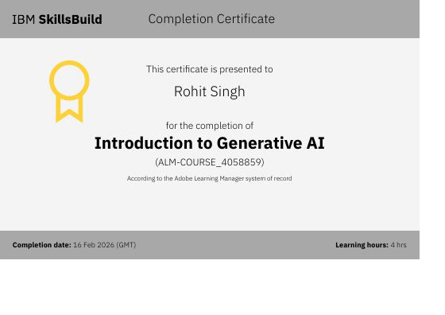
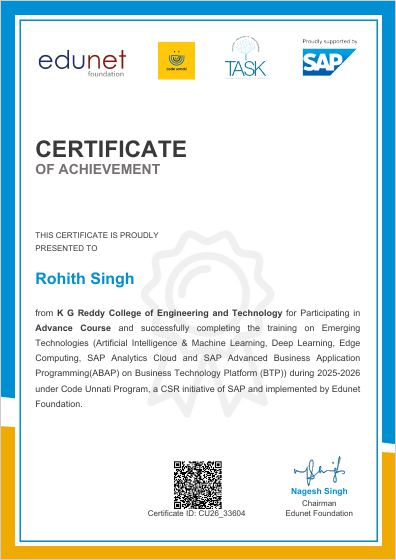
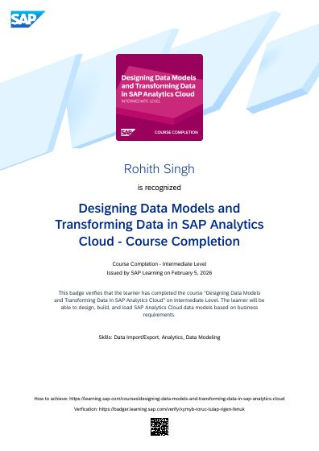
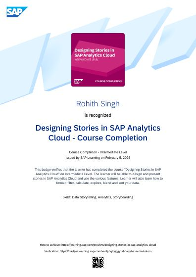
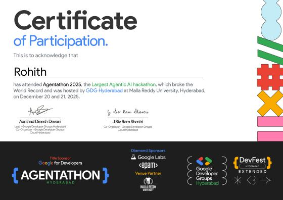

<!-- ═══════════════════════════ HEADER ═══════════════════════════ -->
<div align="center">
  
</div>

<div align="center">
  <a href="https://rohithsing.github.io/Portfolio/">
    
  </a>
</div>

<div align="center">
  <a href="https://rohithsing.github.io/Portfolio/"></a>
  <a href="https://linkedin.com/in/rohithsing"></a>
  <a href="https://instagram.com/r0h1th_s1n9h"></a>
  <a href="https://mail.google.com/mail/?view=cm&fs=1&to=rohitsingh767194@gmail.com"></a>
  <a href="assets/Rohith_Singh_Resume.pdf"></a>
</div>

<br/>

<!-- ═══════════════════════════ ABOUT ═══════════════════════════ -->
## 🧬 `>>> rohith.describe()`

<table>
<tr>
<td width="62%">

```python
class RohithSingh(DataScientist, MLEngineer):
    def __init__(self):
        self.education  = "B.Tech CSE (AI & ML) @ KGRCET, Hyderabad"
        self.graduation = "May 2027"
        self.cgpa       = 7.83
        self.research   = "IEEE CCIC 2026 — Automated Personality Assessment"
        self.experience = ["AI Intern @ IBM SkillsBuild (CSRBOX)"]
        self.focus      = ["Deep RL", "Computer Vision", "NLP", "LLMs",
                           "Medical Imaging", "Document AI"]
        self.motto      = "Transforming data into insights and "
                          "ideas into intelligent systems."

    def current_status(self):
        return "Training models by day, reading papers by night 🌙"
```

</td>
<td width="38%" align="center">
  
  <br/>
  <sub><b>🔭 Open to AI/ML & Data Science internships and research collaborations</b></sub>
  <br/><br/>
  <a href="https://rohithsing.github.io/Portfolio/"><b>✨ Explore my portfolio →</b></a>
</td>
</tr>
</table>

<!-- ═══════════════════════════ HIGHLIGHTS ═══════════════════════════ -->
## 📈 Model Metrics <sub><sup>(a.k.a. highlights)</sup></sub>

<div align="center">

| 🎯 Metric | 📊 Value | 🧪 Context |
|:--|:--:|:--|
| **PU Collision Rate** | `0.0 %` | Dueling Double DQN for 5G/6G spectrum allocation |
| **Throughput Gain** | `40 % +` | DRL agent vs. Round-Robin / Proportional-Fair |
| **SSIM / PSNR** | `0.926 / 34.77 dB` | Hallucination-safe ESRGAN for chest X-rays |
| **Test Accuracy** | `89.54 %` | XGBoost + SMOTE personality prediction (IEEE) |
| **Minority-class F1** | `↑ ~12 %` | Imbalanced-data pipeline optimizations |
| **Hackathon Scale** | `200 + devs` | Buildverse.AI — volunteer coordinator |

</div>

<!-- ═══════════════════════════ PROJECTS ═══════════════════════════ -->
## 🚀 Featured Projects

<table>
<tr>
<td width="50%" valign="top">

### 📡 [5G/6G Spectrum Allocation Simulator](https://github.com/rohithsing/5g-spectrum-simulator)
*Where Deep RL meets next-gen wireless.*

A **Dueling Double DQN** agent learns interference-free Dynamic Spectrum Access, trained on 3 real-world RF datasets fused via **Empirical Copula linkage**. Benchmarked against Round-Robin, PF, Random Forest & XGBoost with KS-test fidelity checks.

🏆 **0.0 % PU collisions** · **40 %+ throughput gain**


[🌐 Live Demo](https://5g-spectrum-simulator.streamlit.app/) · [📂 Code](https://github.com/rohithsing/5g-spectrum-simulator)

</td>
<td width="50%" valign="top">

### 🩻 [X-Ray Enhancement](https://github.com/rohithsing/X-Ray-Enhancement)
*Clinical-grade super-resolution for chest X-rays.*

A **Modified ESRGAN** (RRDBNet, 23 blocks) with a custom **clinical loss** — L1 + MS-SSIM + a fixed **Sobel anti-hallucination** term — trained on NIH ChestX-ray14 with a hardware-grounded degradation pipeline tuned via **Delta-FID + Optuna**.

🏆 **SSIM 0.9262** · **PSNR 34.77 dB** · 3-config ablation


[📂 Code](https://github.com/rohithsing/X-Ray-Enhancement)

</td>
</tr>
<tr>
<td width="50%" valign="top">

### 🏛️ [Chiron AI](https://github.com/rohithsing/Chiron-AI)
*The wise centaur of modern healthcare.*

An LLM-powered health assistant: **AI symptom checker**, **dual-layer drug-interaction analysis** (medical DB + LLM reasoning), allergy-aware medication plans, and a geospatial hospital/pharmacy locator. Privacy-first — zero data persistence.

🏆 Groq low-latency inference · Live on Render


[🌐 Live Demo](https://chiron-ai.onrender.com/) · [📂 Code](https://github.com/rohithsing/Chiron-AI)

</td>
<td width="50%" valign="top">

### 🧠 [Personality Assessment System](https://github.com/rohithsing/personality-assessment-system)
*Big Five traits → ML prediction → your anime twin.* 🎌

A 25-question **OCEAN** assessment feeding an **XGBoost** classifier with engineered interaction features, **SMOTE** balancing and Bayesian tuning — the methodology behind my **IEEE CCIC 2026** paper. Rich Recharts dashboards + offline heuristic fallback.

🏆 **89.54 % accuracy** (paper) · **~12 % ↑ minority F1**


[📂 Code](https://github.com/rohithsing/personality-assessment-system)

</td>
</tr>
<tr>
<td colspan="2" align="center">

### 🎓 Cognify / Eduforge — *Adaptive Learning & Applied AI Platform*
An AI-native LMS with an **NLP-driven chatbot mentor**, **Diffusion-Model** content pipelines and adaptive ML roadmaps tailored to every learner.
<br/>


</td>
</tr>
</table>

<!-- ═══════════════════════════ PIPELINE / EXPERIENCE ═══════════════════════════ -->
## 🔭 Training Log <sub><sup>(experience & research)</sup></sub>

```diff
+ [Feb 2026]  📄 Research Author — IEEE CCIC 2026 (DST-ANRF sponsored, IEEE Region 10)
              "Automated Personality Assessment Using XGBoost"
              → XGBoost + SMOTE pipeline on dense, imbalanced data · 89.54% accuracy
              → Custom feature engineering + Bayesian hyperparameter tuning

+ [Dec 2025]  🤖 Participant — Agentathon 2025 · GDG Hyderabad
              World-record-breaking Agentic AI hackathon

+ [Oct 2025]  🤝 Volunteer Coordinator — Buildverse.AI Hackathon (AI Club, KGRCET)
              → Ops, tech tracks & logistics for 200+ developers

+ [Jan 2025]  ⚡ Participant — AI Hackday 2025 (AI Club, KGRCET)

+ [Jul 2024]  🏢 AI Intern — IBM SkillsBuild (CSRBOX)
              → NLP preprocessing & intent classification for chatbot features
              → Modularized Python prototypes into deployable backend code
              → Benchmarked ML models on real-world datasets
```

<!-- ═══════════════════════════ TECH STACK ═══════════════════════════ -->
## 🛠️ Feature Space <sub><sup>(tech stack)</sup></sub>

<div align="center">

**🧠 AI / ML / Deep Learning**
<br/>


**📊 Data & Analytics**
<br/>


**⚙️ Deployment & Full-Stack**
<br/>

<br/>


</div>

<!-- ═══════════════════════════ CERTIFICATIONS ═══════════════════════════ -->
## 🏅 Certifications & Achievements

<div align="center">
<table>
<tr>
  <td align="center" width="25%"><a href="assets/Certificates/ieee%20certificate.pdf"></a><br/><sub><b>IEEE CCIC 2026</b><br/>Paper Author</sub></td>
  <td align="center" width="25%"><a href="assets/Certificates/IBM%20AI%20Internship%20Certificate.pdf"></a><br/><sub><b>AI Internship</b><br/>IBM SkillsBuild</sub></td>
  <td align="center" width="25%"><a href="assets/Certificates/Claude%20AI%20Fluency.pdf"></a><br/><sub><b>AI Fluency</b><br/>Anthropic</sub></td>
  <td align="center" width="25%"><a href="assets/Certificates/Intro%20to%20GenAI.pdf"></a><br/><sub><b>Intro to Generative AI</b><br/>IBM SkillsBuild</sub></td>
</tr>
<tr>
  <td align="center"><a href="assets/Certificates/SAP.pdf"></a><br/><sub><b>Code Unnati (AI/ML, DL)</b><br/>SAP × Edunet</sub></td>
  <td align="center"><a href="assets/Certificates/Designing%20Data%20Models.pdf"></a><br/><sub><b>Designing Data Models</b><br/>SAP Learning</sub></td>
  <td align="center"><a href="assets/Certificates/Designing%20Stories%20in%20SAP%20Analytics.pdf"></a><br/><sub><b>Stories in SAP Analytics</b><br/>SAP Learning</sub></td>
  <td align="center"><a href="assets/Certificates/Rohith_Agentathon_2025.pdf"></a><br/><sub><b>Agentathon 2025</b><br/>GDG Hyderabad</sub></td>
</tr>
</table>

<details>
<summary><b>📂 More certificates</b></summary>
<br/>

| Certificate | Issuer |
|:--|:--|
| [AI Hackday 2025](assets/Certificates/kgrcet%20hackday%20participation.pdf) | AI Club, KGRCET |
| [Buildverse.AI Hackathon — Volunteer](assets/Certificates/Volunteer.pdf) | AI Club, KGRCET |
| [Programming in Java](assets/Certificates/NPTEL%20Java.pdf) | NPTEL |
| [Python Training](assets/Certificates/PYTHON_Day1.pdf) | CodeApt |
| [Placement Training](assets/Certificates/Placement_Training_3.pdf) | CodeApt |
| [Professional Career Counselling Webinar](assets/Certificates/waste%20participation.pdf) | Elewayte |

</details>
</div>

<!-- ═══════════════════════════ STATS ═══════════════════════════ -->
## 📊 Commit Telemetry

<div align="center">
  
  
  <br/><br/>
  <a href="https://github.com/ashutosh00710/github-readme-activity-graph">
    
  </a>
</div>

<!-- ═══════════════════════════ FOOTER ═══════════════════════════ -->
<br/>

<div align="center">

```python
>>> while alive: learn(); build(); share()
```

<a href="https://rohithsing.github.io/Portfolio/"></a>

</div>


