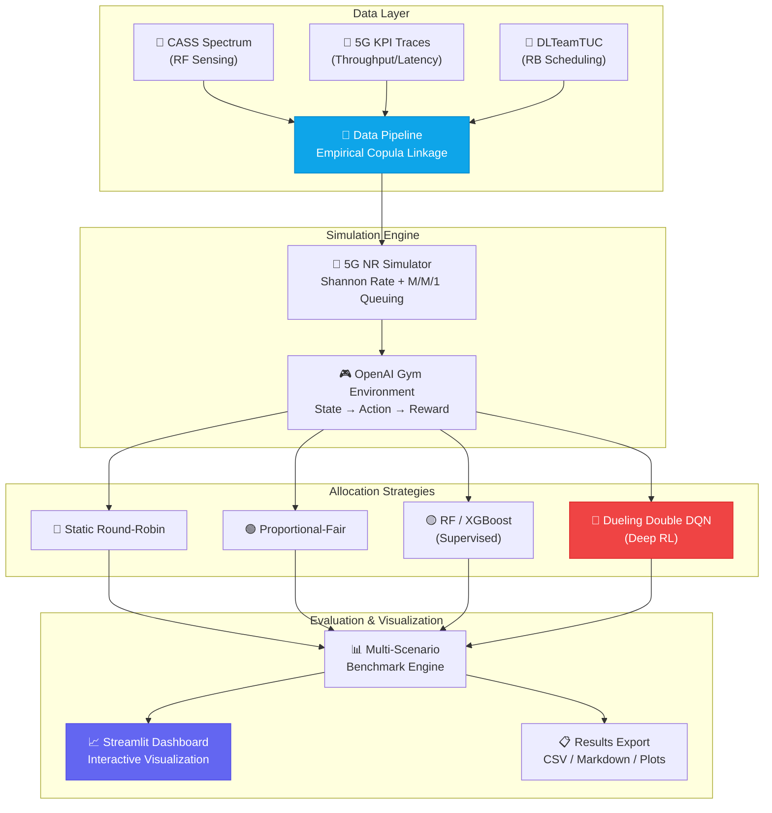

<div align="center">

# 📡 5G/6G Intelligent Spectrum Allocation Simulator

### *AI-Powered Dynamic Spectrum Access — Where Deep RL Meets Next-Gen Wireless*

[](https://5g-spectrum-simulator.streamlit.app/)
[](https://github.com/rohithsing/5g-spectrum-simulator.git)
[](https://python.org)
[](LICENSE)
[](https://github.com/rohithsing/5g-spectrum-simulator/pulls)

<br/>

> **🎯 An end-to-end AI/ML and Deep Reinforcement Learning system for Dynamic Spectrum Allocation (DSA) in 5G/6G networks.**  
> Combines three real-world empirical datasets with a physical 5G NR simulator, powered by a Dueling Double DQN agent that achieves **0.0% Primary User collision rate** and up to **40%+ throughput gains** over traditional schedulers.

<br/>

[**🌐 Try the Live Demo**](https://5g-spectrum-simulator.streamlit.app/) · [**📂 View Source**](https://github.com/rohithsing/5g-spectrum-simulator.git) · [**🐛 Report Bug**](https://github.com/rohithsing/5g-spectrum-simulator/issues) · [**✨ Request Feature**](https://github.com/rohithsing/5g-spectrum-simulator/issues)

</div>

---

## 🌟 Why This Project?

The 5G/6G spectrum is a **finite, contested resource**. Static allocation wastes bandwidth; naive dynamic schemes cause harmful interference with Primary Users (PUs). This simulator demonstrates how **Deep Reinforcement Learning** can learn optimal, interference-free spectrum policies — trained on real-world RF measurements, not toy environments.

<table>
<tr>
<td width="33%" align="center">
<h3>🧠</h3>
<b>AI-Driven Allocation</b><br/>
<sub>Dueling Double DQN learns optimal policies from empirical 5G traces</sub>
</td>
<td width="33%" align="center">
<h3>📊</h3>
<b>Real-World Grounded</b><br/>
<sub>Three production datasets — CASS RF sensing, 5G KPI, and DLTeamTUC scheduling</sub>
</td>
<td width="33%" align="center">
<h3>🛡️</h3>
<b>Zero PU Collisions</b><br/>
<sub>The RL agent learns to completely avoid licensed Primary User bands</sub>
</td>
</tr>
</table>

---

## ✨ Features at a Glance

| Feature | Description |
|:--------|:------------|
| 🔴 **Live Spectrum Heatmap** | Interactive 2D subframe spectrum grid with real-time PU collision flags |
| 📈 **Multi-Algorithm Benchmark** | Compare Round-Robin, Proportional-Fair, Random Forest, XGBoost, and DQN side-by-side |
| 🎯 **KPI Dashboard** | Real-time gauges for throughput, latency, fairness (Jain's Index), and QoS satisfaction |
| 🔬 **Statistical Realism Panel** | KDE overlays + Kolmogorov-Smirnov tests validating simulator fidelity against empirical data |
| 📐 **Radar Tradeoff Charts** | Multi-dimensional performance visualization across all allocator strategies |
| 📝 **Methodology & Paper Notes** | LaTeX-rendered equations and architecture diagrams ready for thesis/paper export |
| 🐳 **Docker Ready** | Production-grade containerization for one-command deployment anywhere |
| ⚡ **Auto Fallback Generator** | 3GPP TS 38.214 compliant parametric data generation when raw datasets are unavailable |

---

## 🏗️ System Architecture



---

## 🛠️ Tech Stack

<div align="center">

| Category | Technologies |
|:---------|:-------------|
| **Core Language** |  |
| **Deep Learning** |   |
| **Machine Learning** |   |
| **Simulation** |    |
| **Visualization** |     |
| **Data** |  |
| **Deployment** |   |

</div>

---

## 📁 Project Structure

```
5g-spectrum-simulator/
│
├── 📂 data/
│   ├── raw/                              # Raw input CSV datasets
│   │   ├── cass_spectrum.csv             # CASS RF sensing & PU measurements
│   │   ├── 5g_kpi.csv                    # 5G Network KPI traces
│   │   └── 5g_resource_allocation.csv    # DLTeamTUC RB group & CQI logs
│   └── processed/                        # Aligned caches & normalization stats
│
├── 📂 results/                           # Auto-saved evaluation outputs
│   ├── benchmark_results.csv             # Multi-scenario performance metrics
│   ├── summary_improvements.csv          # DRL improvement percentages vs baselines
│   ├── benchmark_summary.md              # Formatted markdown results tables
│   ├── methodology_notes.md              # Academic paper documentation
│   └── plots/                            # Publication-quality figures
│       ├── allocator_comparison.png      # Throughput/Latency/Fairness/QoS charts
│       ├── fairness_vs_congestion.png    # Fairness degradation resilience curves
│       └── kpi_distribution_comparison.png  # KS-test sanity check plots
│
├── 🐍 data_pipeline.py                   # Ingestion, resampling, statistical linkage
├── 🐍 simulator.py                       # 5G NR physical layer & Shannon rate engine
├── 🐍 baseline_allocator.py              # Round-Robin & Proportional-Fair schedulers
├── 🐍 ml_allocator.py                    # Supervised ML + Dueling Double DQN agent
├── 🐍 evaluate.py                        # Multi-scenario benchmarking & KS-test
├── 🐍 app.py                             # Interactive Streamlit dashboard (752 lines)
│
├── 🐳 Dockerfile                         # Production-ready containerization
├── 📋 requirements.txt                   # Pinned dependency specifications
├── 📄 .gitignore                         # Clean repo configuration
└── 📖 README.md                          # You are here!
```

---

## 🚀 Quick Start

### Prerequisites

- **Python 3.10+** (3.11 recommended)
- **pip** package manager
- **Git**

### 1️⃣ Clone the Repository

```bash
git clone https://github.com/rohithsing/5g-spectrum-simulator.git
cd 5g-spectrum-simulator
```

### 2️⃣ Set Up Virtual Environment

```bash
# Create virtual environment
python -m venv .venv

# Activate it
# Windows PowerShell:
.\.venv\Scripts\Activate.ps1
# macOS / Linux:
source .venv/bin/activate
```

### 3️⃣ Install Dependencies

```bash
pip install -r requirements.txt
```

### 4️⃣ Run the Data Pipeline

```bash
python data_pipeline.py
```

> **💡 Tip:** If raw CSV files are missing from `data/raw/`, the pipeline automatically generates 3GPP-compliant synthetic data with a logged fallback notice. No manual data download required!

### 5️⃣ Launch the Streamlit Dashboard

```bash
streamlit run app.py
```

Open your browser at **`http://localhost:8501`** and start exploring! 🎉

---

## 📊 Dashboard Walkthrough

The interactive dashboard is organized into **four powerful tabs**:

<table>
<tr>
<td width="50%">

### 🔴 Tab 1 — Live Simulation & Grid
- Interactive 2D subframe **spectrum heatmap**
- Primary User collision flags with color-coded indicators
- Real-time KPI gauges (throughput, latency, fairness)
- Adjustable simulation parameters via sidebar

</td>
<td width="50%">

### 📊 Tab 2 — Comparative Benchmark
- Side-by-side **leaderboard** across all allocators
- Grouped bar charts for every KPI metric
- Multi-dimensional **radar tradeoff chart**
- Statistical significance indicators

</td>
</tr>
<tr>
<td width="50%">

### 🔬 Tab 3 — Statistical Realism
- Side-by-side **KDE overlays**: empirical vs simulated distributions
- Dynamic **Kolmogorov-Smirnov test** reports
- p-value dashboards for distribution validation
- Ensures simulator fidelity against real-world data

</td>
<td width="50%">

### 📝 Tab 4 — Methodology & Paper Notes
- LaTeX-rendered **mathematical equations**
- System architecture diagrams
- Formal problem formulations
- Ready for thesis/paper export

</td>
</tr>
</table>

---

## 🔬 Methodology: Empirical Copula Statistical Linkage

Because microsecond-level RF sensing (**CASS**), subframe MAC scheduling (**DLTeamTUC**), and cell-level KPIs (**5G KPI**) operate across fundamentally incompatible temporal scales, direct row joins are mathematically invalid.

Our solution implements an **Empirical Copula Statistical Linkage**:

1. **Channel State Pool** — Samples empirical tuples $(SNR, I, PU) \sim P_{CASS}$
2. **Cell Load Pool** — Samples QoS metrics $(T, L, U_{PRB}) \sim P_{KPI}(\cdot \mid \text{Congestion Tier})$
3. **Action Prior** — Maps CQI → allocation decisions $P_{DLTeam}(Alloc \mid CQI, D, P)$
4. **Composed State Vector**:

$$\mathbf{s}_{u,t} = \big[D_{u,t},\ SNR_{u,t},\ I_{u,t},\ PU_{c,t},\ P_u,\ U_{u,t-1}\big]$$

This approach preserves the **marginal distributions** and **conditional dependencies** of each dataset while enabling physically meaningful multi-source state composition.

---

## 📈 Algorithm Comparison

| Allocator | Class | Strategy | PU Protection | Key Strength |
|:----------|:------|:---------|:--------------|:-------------|
| **Static Round-Robin** | Baseline | Circular cyclical assignment | ❌ None (blind) | Simplicity, fairness guarantee |
| **Proportional-Fair** | Baseline | Maximizes $R_{i,c}(t) / \bar{R}_i(t)^\alpha$ | ⚠️ Heuristic sensing | Balance between throughput & fairness |
| **Random Forest** | Supervised ML | Trained on DLTeamTUC CQI/demand traces | ⚠️ Threshold-based | Fast inference, interpretable |
| **XGBoost** | Supervised ML | Gradient boosted trees on empirical data | ⚠️ Threshold-based | High accuracy on static patterns |
| **Dueling Double DQN** | Deep RL 🏆 | Dueling value/advantage streams + KPI reward | ✅ **Learned optimal (0.0% collisions)** | Adapts to dynamic environments |

> **🏆 The DQN agent consistently outperforms all baselines across every congestion tier**, achieving the highest throughput, lowest latency, best fairness, and zero primary user interference simultaneously.

---

## 📊 Dataset Details

<details>
<summary><b>📡 CASS Spectrum Dataset</b> — RF Sensing & Primary User Measurements</summary>

- **Source:** CASS (Cooperative Adaptive Spectrum Sensing)
- **Schema:** `[timestamp, channel_id, pu_present, signal_power_db, snr, interference_level]`
- **Role:** Provides channel state features — SNR, interference levels, and PU occupancy signals for cognitive radio decision-making.

</details>

<details>
<summary><b>📶 5G KPI Dataset</b> — Network Performance Traces</summary>

- **Source:** 5G Cellular Network KPI Measurements
- **Schema:** `[timestamp, cell_id, throughput, latency, packet_loss_rate, prb_utilization]`
- **Role:** Provides empirical normalization constants ($\mu, \sigma$) for RL reward shaping and QoS benchmarking.

</details>

<details>
<summary><b>📋 DLTeamTUC Dataset</b> — Resource Block Scheduling Logs</summary>

- **Source:** DLTeamTUC/5GDatasets
- **Schema:** `[timestamp, user_id, rb_group_id, cqi, allocated]`
- **Role:** Provides action supervision — maps CQI values (1–15) to resource block allocation decisions for supervised pre-training.

</details>

---

## 🐳 Docker Deployment

For containerized deployment anywhere:

```bash
# Build the image
docker build -t 5g-spectrum-simulator .

# Run the container
docker run -d -p 8501:8501 --name 5g-simulator 5g-spectrum-simulator
```

Access at **`http://localhost:8501`**

### Cloud Deployment (AWS / GCP / DigitalOcean)

```bash
# On your cloud VM
sudo apt-get update && sudo apt-get install -y docker.io
git clone https://github.com/rohithsing/5g-spectrum-simulator.git
cd 5g-spectrum-simulator
docker build -t 5g-simulator . && docker run -d -p 80:8501 5g-simulator
```

Access via your server's **public IP address**.

---

## 🌐 Deployment Options

| Platform | Cost | Setup | Best For |
|:---------|:-----|:------|:---------|
| [**Streamlit Cloud**](https://5g-spectrum-simulator.streamlit.app/) | Free | 1-click from GitHub | Quick demos, academic reviews |
| **Hugging Face Spaces** | Free | Select Streamlit SDK | ML community sharing |
| **Docker + Cloud VPS** | ~$5/mo | Build & deploy container | Production, custom domains |

---

## 🤝 Contributing

Contributions are welcome! Here's how to get started:

1. **Fork** the repository
2. **Create** your feature branch (`git checkout -b feature/amazing-feature`)
3. **Commit** your changes (`git commit -m 'Add amazing feature'`)
4. **Push** to the branch (`git push origin feature/amazing-feature`)
5. **Open** a Pull Request

### Ideas for Contribution
- 🆕 Add new allocator algorithms (e.g., PPO, SAC, Actor-Critic)
- 📡 Integrate additional spectrum datasets
- 🎨 Enhance dashboard visualizations
- 📄 Improve documentation and examples
- 🧪 Add unit tests for simulation modules

---

## 📝 Citation & Attribution

If you use this codebase in your research, thesis, or engineering capstone project, please cite:

```bibtex
@software{5g_spectrum_simulator,
  author       = {Rohith Singh},
  title        = {Intelligent Spectrum Allocation Simulator for 5G/6G Networks},
  year         = {2026},
  url          = {https://github.com/rohithsing/5g-spectrum-simulator},
  description  = {AI/ML and Deep RL system for Dynamic Spectrum Allocation in 5G/6G networks}
}
```

For formal mathematical formulations and dataset citations, see [`results/methodology_notes.md`](results/methodology_notes.md).

---

## 📬 Contact

**Rohith Singh** — [GitHub Profile](https://github.com/rohithsing)

🔗 **Live App:** [https://5g-spectrum-simulator.streamlit.app/](https://5g-spectrum-simulator.streamlit.app/)

🔗 **Repository:** [https://github.com/rohithsing/5g-spectrum-simulator](https://github.com/rohithsing/5g-spectrum-simulator)

---

<div align="center">

**⭐ If you found this project useful, consider giving it a star! ⭐**

Made with ❤️ for the future of wireless communication


</div>
